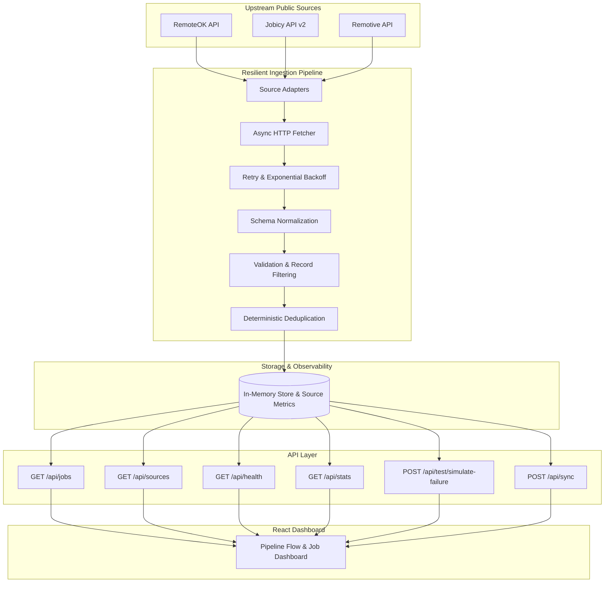

# SIGNAL — Multi-Source Job Ingestion Platform

SIGNAL is a high-reliability, fault-tolerant job intelligence platform engineered for **Acdyon Technologies Challenge Part 1** (“Getting Data Out of a Platform That Doesn’t Want You To”). It aggregates, normalizes, validates, and deduplicates remote job listings from public sources (**RemoteOK**, **Jobicy**, and **Remotive**).

---

## 🏗 System Architecture & Ingestion Flow



### Ingestion Flow Stages
`Source → Fetcher → Retry / Backoff → Normalize → Validate → Deduplicate → API → Dashboard`

### Failure / Fallback Path
1. **Per-Source Isolation**: If a single source times out or returns HTTP 5xx, the error is recorded on that adapter (`status: "degraded"`), while the remaining healthy sources continue fetching and serving live data.
2. **Partial Degraded Mode**: The API returns `200 OK` with `status: "degraded"` and partial live jobs.
3. **Fallback Dataset**: If all live sources fail simultaneously and no cached data exists, SIGNAL activates a validated local fallback dataset so the application never crashes or presents a blank state.

---

## ⚙️ Core Engineering Features

### 1. Isolated Source Adapters (`backend/adapters.py`)
Modular classes extending `BaseSourceAdapter` (`RemoteOKAdapter`, `JobicyAdapter`, `RemotiveAdapter`), encapsulating provider-specific fetching, schema mapping, and validation.

### 2. Multi-Tier Skill Extractor
Evaluates skills across a 70+ technology dictionary:
1. Explicit source skills & tags
2. Full job description scanning
3. Job title scanning
Strict word-boundary matching (`\b`) prevents false positives (`Java` vs `JavaScript`, `C` vs `CSS`).

### 3. Cross-Source Deduplication
Deduplicates jobs using normalized canonical URLs (stripping query parameters and protocols) and composite hashes `(company:title:location)`.

### 4. Live Interview Failure Simulation (`POST /api/test/simulate-failure`)
Supports simulating `timeout`, `http_error`, `empty`, or `malformed` payloads for any source during live interview demonstrations without altering production code.

---

## 🔌 API Reference

| Endpoint | Method | Description |
|---|---|---|
| `/api/jobs` | GET | Query jobs with filters (`q`, `source`, `location`, `category`, `limit`) |
| `/api/sources` | GET | Per-source observability metrics (`fetched`, `accepted`, `rejected`, `duplicates`, `status`) |
| `/api/health` | GET | System health and source availability status |
| `/api/stats` | GET | Summary statistics (`stored`, `by_source`, `india_jobs`, `remote_jobs`) |
| `/api/sync` | POST | Trigger immediate re-sync across all sources |
| `/api/test/simulate-failure` | POST | Simulate source failure for live interview demos |

---

## 🚀 Local Execution Commands

### Environment Variables

| Variable | Local / Dev | Render Production | Description |
|---|---|---|---|
| `ENVIRONMENT` | `development` (or unset) | `production` | Enforces production security guards on test endpoints |
| `ALLOW_TEST_SIMULATION` | `false` (or unset) | Do NOT set (`false`) | Guard for `/api/test/simulate-failure`. Returns HTTP 403 in production unless explicitly set |

### Backend (FastAPI)
```bash
cd backend
pip install -r requirements.txt
uvicorn main:app --reload --port 8000
```

### Frontend (React + Vite)
```bash
npm install
npm run dev
```

### Build & Typecheck Verification
```bash
npm run typecheck
npm run build
```